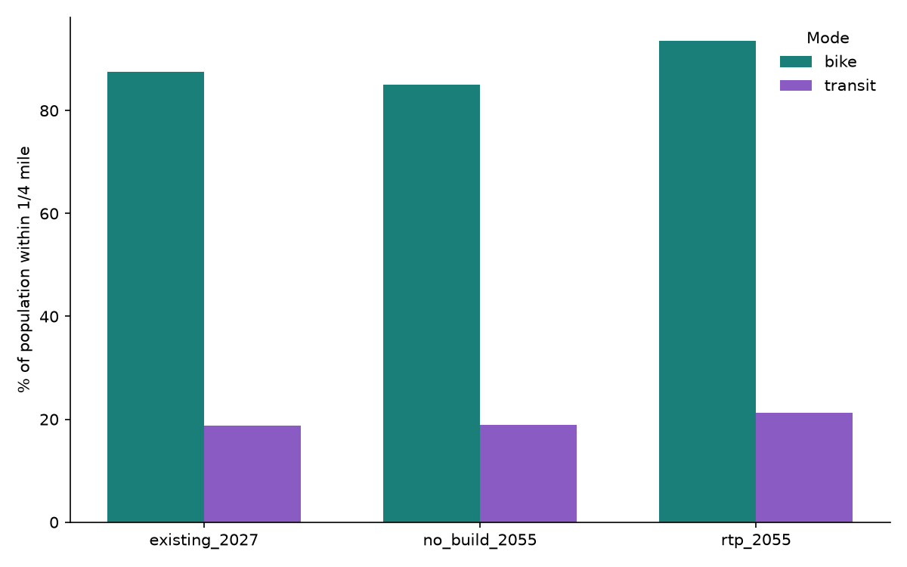

A working index of ad hoc geospatial analyses for WFRC. Each analysis lives in its own folder under `projects/`, with its own data sources, script/notebook, and outputs. See `README.md` and `CLAUDE.md` at the repo root for conventions.

To start a new analysis, copy `projects/_template/` (its underscore prefix keeps it -- and any other in-progress scaffold folder -- out of this published site by convention).

## [Center Buildout Capacity](projects/center-buildout-capacity/index.qmd)

REMM's 2025 estimate, its 2055 forecast, and full buildout capacity for six Wasatch Choice Vision centers: Daybreak, Saratoga Springs Downtown, The Point, Ogden Downtown, Clearfield, and Farmington Station Park.

::: {layout-ncol="2"}
{.lightbox group="center-buildout-capacity"}

{.lightbox group="center-buildout-capacity"}
:::

## [Transportation Choices](projects/transportation-choices/index.qmd)

Percent of the WFRC-region population within 1/4 mile of a dedicated bike facility, or a frequent bus route / transit stop / station, across three scenarios: Existing 2027, No Build 2055, and RTP (Build) 2055.

{.lightbox group="transportation-choices"}
