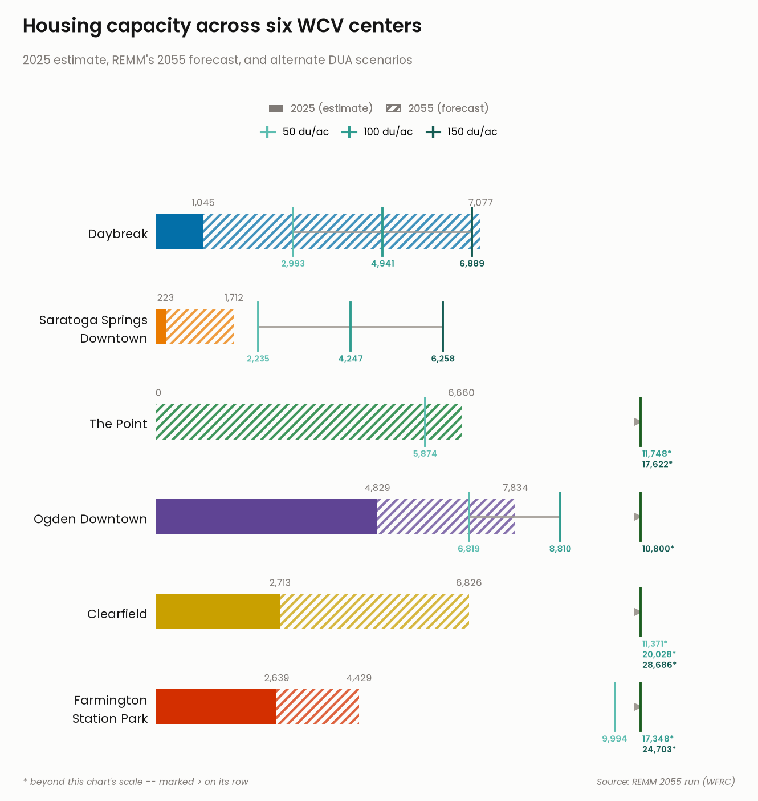
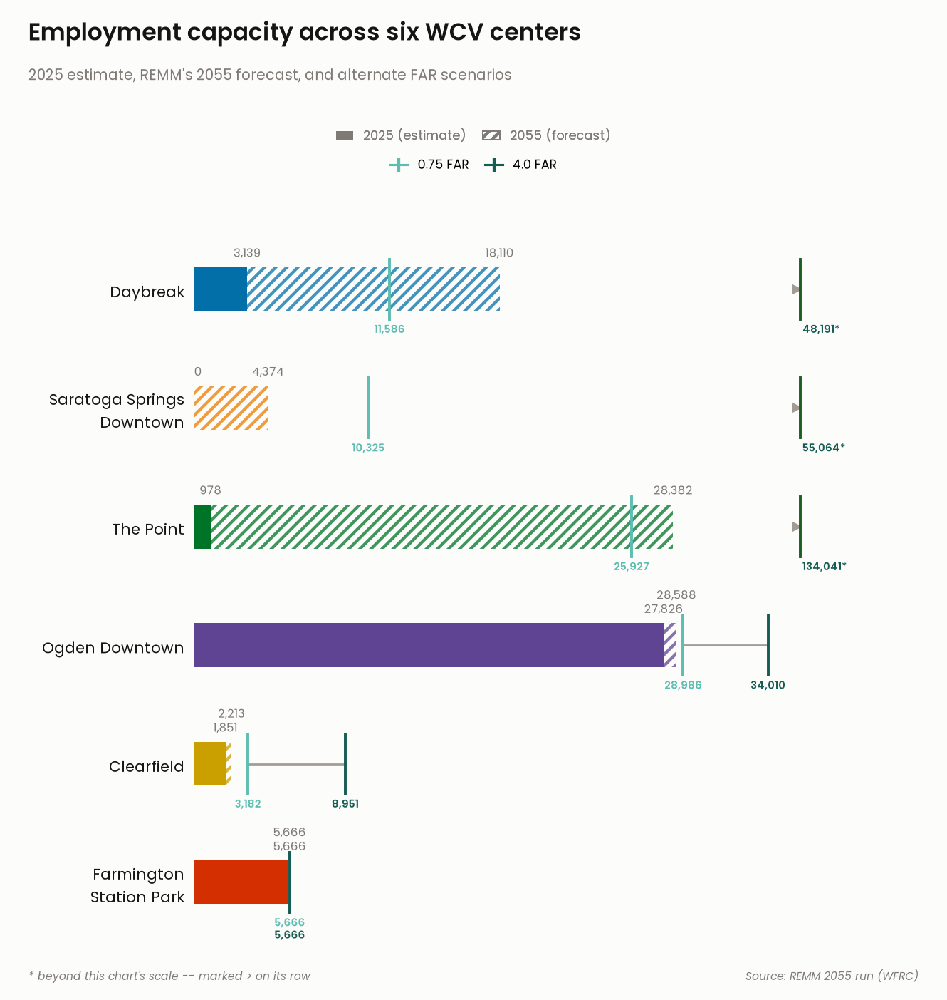

## Overview

"Centers" are the places identified in the region's long-range vision
([Wasatch Choice](https://wasatchchoice.org/))
as the best spots to concentrate future housing and job growth -- walkable,
mixed-use areas near transit and existing infrastructure -- rather than
letting growth spread outward across the whole region.

This analysis is built on the region's Real Estate Market Model (REMM, an
UrbanSim-based simulation), anchored to a **2023 base year** -- the most
recent point at which REMM was calibrated against real, observed
development. Every figure after that point, including "2025," is the
model's own simulated projection forward from that base year, not a
directly observed count.

This analysis looks at six of those centers -- **Daybreak**, **Saratoga
Springs Downtown**, **The Point**, **Ogden Downtown**, **Clearfield**, and
**Farmington Station Park** -- and answers the same three questions for
each one:

1. **What does the model estimate for 2025?** REMM's projection of homes
   and jobs in each center two years past the 2023 base year -- the
   closest thing to a "current" figure this model can produce, but still a
   simulated estimate, not a directly observed count.
2. **Where is growth headed by 2055?** The region's parcel-level growth
   model (REMM) simulates how each center actually develops between now and
   2055.
3. **How much room is left at full buildout?** Beyond the 2055 forecast,
   how many additional homes and jobs current zoning would allow once a
   center is fully built out.

Jump straight to the [map](#where-are-these-centers) or the
[capacity charts](#capacity-at-a-glance) below, or read on for how each
number is derived.

::: {.callout-note collapse="true"}
## Where the center boundaries come from

Not every center's boundary is a simple, single polygon tagged the way the
original three centers were:

- **Ogden Downtown** is coded `CenterType = 'Metropolitan Center'`, not
  `'Urban Center'`.
- **Clearfield** isn't one polygon at all -- it's three separate source
  rows (`Downtown Clearfield`, `Clearfield Station`, and `Downtown Gateway
  (South)`) folded together into a single "Clearfield" for this analysis.
- **Farmington Station Park** is stored in the source data simply as
  `Station Park` (`City = 'Farmington'`) -- the source doesn't prefix it
  with the city name the way this analysis's name does.

Because of that, the boundary source can't be filtered with one blanket
rule like "every `Urban Center` polygon" -- it fetches by each raw name
individually (excluding `CenterType = 'Employment District'`, which would
otherwise pull in The Point's redundant second polygon), then remaps those
raw names down to the six analysis center names used everywhere below.
:::

```{python}
#| code-summary: "Centers of interest and boundary-source name mapping"
CENTERS_OF_INTEREST = [
    "Daybreak", "Saratoga Springs Downtown", "The Point",
    "Ogden Downtown", "Clearfield", "Farmington Station Park",
]

# raw center_boundaries CenterName -> analysis center name. Centers with a
# 1:1 raw-to-analysis mapping still get an entry so RAW_CENTER_NAMES (the
# where-filter's IN-list) and the remap step both come from this one dict.
RAW_TO_ANALYSIS = {
    "Daybreak": "Daybreak",
    "Saratoga Springs Downtown": "Saratoga Springs Downtown",
    "The Point": "The Point",
    "Ogden Downtown": "Ogden Downtown",
    "Downtown Clearfield": "Clearfield",
    "Clearfield Station": "Clearfield",
    "Downtown Gateway (South)": "Clearfield",
    "Station Park": "Farmington Station Park",
}
RAW_CENTER_NAMES = list(RAW_TO_ANALYSIS.keys())
```

```{python}
#| output: false
#| code-summary: "Table display helper (thousands separators, 2 decimals for rates)"
import pandas as pd


def show(df, rename=None):
    """Display df with thousands separators, text left-aligned and numbers
    right-aligned -- consistent formatting for every table on this page.
    A float column only gets 2 decimal places if it actually holds
    fractional values (e.g. dwelling units/acre, FAR); one that happens to
    be whole throughout (e.g. a home/job count already rounded upstream)
    displays with no decimal point at all, same as a true integer column."""
    df = df.rename(columns=rename) if rename else df
    fmt, numeric_cols = {}, []
    for col, dtype in df.dtypes.items():
        if pd.api.types.is_float_dtype(dtype):
            values = df[col].dropna()
            whole = values.empty or (values % 1 == 0).all()
            fmt[col] = "{:,.0f}" if whole else "{:,.2f}"
            numeric_cols.append(col)
        elif pd.api.types.is_integer_dtype(dtype):
            fmt[col] = "{:,.0f}"
            numeric_cols.append(col)
    text_cols = [c for c in df.columns if c not in numeric_cols]

    styler = df.style.format(fmt, na_rep="--")
    if numeric_cols:
        styler = styler.set_properties(subset=numeric_cols, **{"text-align": "right"})
    if text_cols:
        styler = styler.set_properties(subset=text_cols, **{"text-align": "left"})
    # column headers follow their own column's alignment; the row index
    # (e.g. CenterName) is text, so its header/values stay left-aligned
    table_styles = [{"selector": "th.row_heading, th.index_name", "props": "text-align: left;"}]
    for col in numeric_cols:
        table_styles.append({"selector": f"th.col{df.columns.get_loc(col)}", "props": "text-align: right;"})
    for col in text_cols:
        table_styles.append({"selector": f"th.col{df.columns.get_loc(col)}", "props": "text-align: left;"})
    return styler.set_table_styles(table_styles, overwrite=False)
```

## Where are these centers? {#where-are-these-centers}

The map below shows the boundary used for each center in this analysis,
along with each source record's current zoning caps -- dwelling units per
acre for residential, floor-area-ratio (FAR) for non-residential -- used
later in the [full buildout](#how-much-room-is-left-at-full-buildout)
estimate.

```{python}
#| code-summary: "Fetch center boundaries"
from gis_adhoc_analyses.layer_cache import ensure_layers
import geopandas as gpd

L = ensure_layers(["center_boundaries"])
centers_preview = gpd.read_file(
    L["center_boundaries"],
    where=f"CenterName IN ({', '.join(map(repr, RAW_CENTER_NAMES))}) AND CenterType <> 'Employment District'",
)
# fold Clearfield's three raw polygons (and every other 1:1 raw name) down to
# their analysis center name, so the map's legend/colors match the six
# centers this analysis reports on, not the source's raw row names.
centers_preview["AnalysisCenter"] = centers_preview["CenterName"].map(RAW_TO_ANALYSIS)
show(
    centers_preview[["AnalysisCenter", "CenterName", "CenterType", "City", "DwellingPerAcre", "NonResFAR"]],
    rename={
        "AnalysisCenter": "Analysis center", "CenterName": "Source record name",
        "CenterType": "Center type", "DwellingPerAcre": "Zoning cap (DU/acre)",
        "NonResFAR": "Zoning cap (non-res FAR)",
    },
)
```

Hover over a shape on the map below for its name, type, and city.

```{python}
#| code-summary: "Interactive map of center boundaries"
centers_preview.explore(
    column="AnalysisCenter", tooltip=["AnalysisCenter", "CenterType", "City"], legend=True
)
```

::: {.callout-note collapse="true"}
## Parcel data and how parcels are assigned to a center

Homes and jobs are counted from the region's REMM parcel/building tables
(base-year parcels plus a 2055 simulation run), not from the center
boundary layer itself. The base-year parcels arrive as a large FileGDB and
get cached as GeoParquet on first run so later runs read that instead of
re-parsing the FileGDB every time.

A parcel is assigned to whichever center its **centroid** (not its full
shape) falls inside. That avoids double-counting a parcel that happens to
straddle a center's boundary line -- it lands in exactly one center instead
of both.

```{python}
#| output: false
#| code-summary: "Load and cache REMM parcels/buildings as parquet"
from pathlib import Path

import pandas as pd

paths = {
    "raw": Path("_data/raw"),
    "processed": Path("_data/processed"),
}
paths["processed"].mkdir(parents=True, exist_ok=True)

paths.update({
    "gdb": paths["raw"] / "remm" / "remm_base_year_data.gdb",
    "buildings_2055_pkl": paths["raw"] / "remm" / "run1842year2055allbuildings.pkl",
    "progression_2055_pkl": paths["raw"] / "remm" / "run_1842_year_2055_parcel_progression_metrics.pkl",
    "parcels_geoparquet": paths["processed"] / "parcels_2023.parquet",
    "centers_geoparquet": paths["processed"] / "centers.parquet",
    "buildings_2055_parquet": paths["processed"] / "buildings_2055.parquet",
    "progression_2055_parquet": paths["processed"] / "progression_2055.parquet",
})

# one-time read of the two vector sources, cached as GeoParquet so later runs
# don't re-parse the FileGDB or re-fetch the REST layer. Each cache is a full
# replica of every source column -- selecting only the columns actually
# needed for a given step happens later, at read time (via `columns=`), not
# by trimming what gets cached here.
if not paths["parcels_geoparquet"].exists():
    parcels_gdf = gpd.read_file(paths["gdb"], layer="parcels")
    # Split_Factor/MAG_parcel_id mix strings with a couple of real NaNs, which
    # pyarrow can't write as a single column type -- nullable string dtype
    # keeps those as actual nulls (not the literal string "nan").
    parcels_gdf["Split_Factor"] = parcels_gdf["Split_Factor"].astype("string")
    parcels_gdf["MAG_parcel_id"] = parcels_gdf["MAG_parcel_id"].astype("string")
    parcels_gdf.to_parquet(paths["parcels_geoparquet"])

if not paths["centers_geoparquet"].exists():
    centers_gdf = gpd.read_file(
        L["center_boundaries"],
        where=f"CenterName IN ({', '.join(map(repr, RAW_CENTER_NAMES))}) AND CenterType <> 'Employment District'",
    )
    # fold Clearfield's three raw polygons (and every other 1:1 raw name)
    # down to their analysis center name here, once, so every downstream
    # groupby("CenterName") aggregates across all of a center's raw rows
    # without needing to know Clearfield is special.
    centers_gdf["CenterName"] = centers_gdf["CenterName"].map(RAW_TO_ANALYSIS)
    centers_gdf.to_parquet(paths["centers_geoparquet"])

if not paths["buildings_2055_parquet"].exists():
    buildings_full = pd.read_pickle(paths["buildings_2055_pkl"]).reset_index()
    # 'note' mixes real strings with an int 0 sentinel (no dedicated null),
    # which pyarrow can't write as a single column type. 0 means "no note", so
    # it's replaced with an actual null rather than becoming the string "0".
    buildings_full["note"] = buildings_full["note"].replace(0, pd.NA).astype("string")
    buildings_full.to_parquet(paths["buildings_2055_parquet"])

if not paths["progression_2055_parquet"].exists():
    # no mixed-type columns here, so a plain conversion is enough
    pd.read_pickle(paths["progression_2055_pkl"]).to_parquet(paths["progression_2055_parquet"])

# only the columns needed for the spatial join below (geometry + acreage/name) --
# other columns (max_far, max_dua, DwellingPerAcre, ...) get pulled later, from
# the same cached files, only where they're actually used.
parcels = gpd.read_parquet(paths["parcels_geoparquet"], columns=["parcel_id", "parcel_acres", "geometry"])
centers = gpd.read_parquet(
    paths["centers_geoparquet"], columns=["CenterName", "CenterType", "geometry"]
).to_crs(parcels.crs)  # centers ships in EPSG:4326 (WGS84) from the REST layer; parcels are in EPSG:26912 (UTM 12N)

# swap each parcel's polygon for its centroid point -- a polygon can legitimately
# intersect two centers along a shared edge, but its centroid falls in exactly one.
parcel_centroids = parcels.set_geometry(parcels.geometry.centroid)

# predicate="within": keep a parcel only if its centroid point falls inside a
# center polygon. how="inner" drops parcels whose centroid falls in no center
# at all (most of the region -- centers are a tiny fraction of all parcels).
parcels_in_centers = gpd.sjoin(
    parcel_centroids, centers[["CenterName", "geometry"]], predicate="within", how="inner"
)[["parcel_id", "parcel_acres", "CenterName"]]

parcels_per_center = parcels_in_centers.groupby("CenterName").agg(
    n_parcels=("parcel_id", "count"), total_acres=("parcel_acres", "sum")
)

# parcels within our centers of interest, reused by every metric below.
# parcels_in_centers already only contains parcels inside those centers
# (centers.parquet was itself built from the where-filtered fetch, then
# remapped to analysis center names) -- this isin() is a defensive, explicit
# filter so downstream cells don't silently depend on that upstream scoping.
our_parcels = parcels_in_centers[parcels_in_centers["CenterName"].isin(CENTERS_OF_INTEREST)]
```
:::

Across the six centers combined, this is the land and parcel count each
center's figures below are drawn from:

```{python}
#| code-summary: "Parcels and acreage per center"
show(parcels_per_center, rename={"n_parcels": "Number of parcels", "total_acres": "Total acres"})
```

## Estimated homes and jobs in 2025

Every center's 2025 figure is a model estimate, not an observed count: it
comes from REMM's simulation, counting buildings the model shows as
constructed by 2025 -- REMM's own projection two years past its 2023 base
year, using the same method for every center.

```{python}
#| code-summary: "Compute REMM's modeled 2025 homes and jobs per center"
buildings_2055 = pd.read_parquet(
    paths["buildings_2055_parquet"],
    columns=["parcel_id", "year_built", "general_type", "residential_units", "job_spaces"],
)

current_year = (
    buildings_2055[buildings_2055["year_built"] <= 2025]
    .merge(our_parcels[["parcel_id", "CenterName"]], on="parcel_id")
    .groupby("CenterName")[["residential_units", "job_spaces"]]
    .sum()
    .rename(columns={"residential_units": "homes", "job_spaces": "jobs"})
)
show(current_year, rename={"homes": "Homes (2025 est.)", "jobs": "Jobs (2025 est.)"})
```

::: {.callout-note collapse="true"}
## Why The Point's 2025 job count looks like it drops

No dedicated 2025 REMM run exists (only "2023" and "2055" simulations), so
2025 figures are derived by filtering the 2055 run's building-level data to
`year_built <= 2025` and summing homes/jobs per center -- one shared method
for every center.

That method reproduces the dedicated 2023 run almost exactly for Daybreak
and Saratoga Springs Downtown, but not for The Point: the two REMM runs
disagree on The Point's historical baseline (2023 run: 0 homes / 2,474
jobs vs. 2055-run-filtered: 0 homes / 978 jobs as of 2025). That's not
treated as a data error here -- **The Point was Utah's state prison site
until it closed and redevelopment began**, so a real drop from ~2,474 jobs
(2023, pre-closure) to ~978 (2025, post-closure, pre-redevelopment) is a
plausible reading of an actual event, not a modeling glitch. This same
derivation method applies uniformly to Ogden Downtown, Clearfield, and
Farmington Station Park too -- no dedicated 2023/2025 run exists for any
center beyond the original three, so there's no equivalent cross-check
available for them.
:::

## Where growth is headed by 2055

REMM is the region's parcel-level land-use simulation model -- it projects,
parcel by parcel, how each center is likely to actually develop and
redevelop through 2055 given current trends, zoning, and market conditions.
This figure is REMM's own simulated outcome, summed across every parcel in
a center (not just the ones that redevelop after 2025).

```{python}
#| code-summary: "Compute REMM's 2055 forecast homes and jobs per center"
progression_2055 = pd.read_parquet(
    paths["progression_2055_parquet"], columns=["parcel_id", "residential_units", "job_spaces"]
)

forecast_2055 = (
    our_parcels.merge(progression_2055, on="parcel_id")
    .groupby("CenterName")[["residential_units", "job_spaces"]]
    .sum()
    .rename(columns={"residential_units": "homes", "job_spaces": "jobs"})
)
show(forecast_2055, rename={"homes": "Homes (2055 forecast)", "jobs": "Jobs (2055 forecast)"})
```

::: {.callout-note collapse="true"}
## How this figure is calculated

Sums `parcel_progression_metrics`'s `residential_units`/`job_spaces` --
verified reliable per-parcel totals across all of a parcel's buildings,
unlike `year_built`, which only reflects one representative building --
across all parcels in each center. This is exactly what The Point's full
buildout figure below already is, since REMM shows nothing left
developable there by 2055.
:::

## How much room is left at full buildout

Beyond what REMM's 2055 simulation forecasts, most centers still have land
that current zoning would allow to develop further. This analysis
estimates that additional room two different ways, depending on the
center:

- **The Point**: REMM's own 2055 simulation shows **no parcels left
  undeveloped** there -- the whole center is already at full buildout by
  2055, so its full-buildout figure *is* the 2055 forecast above, no
  further estimate needed.
- **Every other center** (Daybreak, Saratoga Springs Downtown, Ogden
  Downtown, Clearfield, Farmington Station Park): REMM still shows
  land redeveloping past 2025. For that land, this analysis estimates
  *additional* homes and jobs on top of the 2025 estimate above, using
  REMM's own forecast mix of residential vs. commercial/employment
  development, applied at each center's median current zoning density.

::: {.callout-note collapse="true"}
## Developable land

A parcel counts as "developable" here if REMM shows a building on it with
`year_built > 2025` -- i.e., REMM itself simulates something new getting
built there after 2025. This is computed for every center, including The
Point (there, only as an exploratory cross-check -- see above).

```{python}
#| output: false
#| code-summary: "Identify developable (post-2025) parcels and acreage"
# inner join: only buildings whose parcel_id is one of our centers' parcels survive.
buildings_in_centers = buildings_2055.merge(our_parcels[["parcel_id", "CenterName"]], on="parcel_id")

# a parcel can have multiple buildings -- .unique() collapses "one row per
# building built after 2025" down to "one row per qualifying parcel".
post_2025_parcel_ids = buildings_in_centers.loc[
    buildings_in_centers["year_built"] > 2025, "parcel_id"
].unique()

developable_land = (
    our_parcels[our_parcels["parcel_id"].isin(post_2025_parcel_ids)]
    .groupby("CenterName")
    .agg(n_parcels=("parcel_id", "count"), dev_acres=("parcel_acres", "sum"))
    .reset_index()
)
```
:::

```{python}
#| code-summary: "Developable (post-2025) acreage per center"
show(
    developable_land.set_index("CenterName"),
    rename={"n_parcels": "Developable parcels", "dev_acres": "Developable acres"},
)
```

::: {.callout-note collapse="true"}
## Development mix and density assumptions

Each center's developable acreage is split between residential and
commercial/employment uses using REMM's own forecast mix for that center's
post-2025 parcels, then multiplied by that center's **median** current
zoning density (dwelling-units-per-acre for residential, floor-area-ratio
for commercial/employment) to estimate additional homes and jobs.

**Known limitation:** for Daybreak specifically, several of its post-2025
parcels are large master-planned "super-parcels" whose actual REMM-
simulated density (up to ~280 units/acre) far exceeds their generic zoning
entitlement (recorded `max_dua` of just 30) -- Daybreak's real approved
density (high-rise towers via a specific development agreement) isn't
fully captured by the zoning fields this method relies on. That
understates Daybreak's true buildout capacity. The same understatement
pattern -- full-buildout capacity landing *below* the 2055 forecast, which
shouldn't happen if capacity is a real ceiling -- also shows up for
Saratoga Springs Downtown and, to a smaller degree, Ogden Downtown -- see
the note under
[the summary table](#the-bottom-line-all-six-centers-at-a-glance) below.

```{python}
#| output: false
#| code-summary: "Forecast development mix (residential vs. non-residential share)"
dev_mix = (
    our_parcels[our_parcels["parcel_id"].isin(post_2025_parcel_ids)][["parcel_id", "CenterName"]]
    .merge(progression_2055, on="parcel_id")
    .groupby("CenterName")[["residential_units", "job_spaces"]]
    .sum()
)
dev_mix["unit_job_ratio"] = dev_mix["residential_units"] / dev_mix["job_spaces"]

# res_share/nonres_share are the same ratio re-expressed as shares of a whole
# (res_share = unit_job_ratio / (unit_job_ratio + 1)) -- this is what actually
# gets multiplied against acreage below.
dev_mix["res_share"] = dev_mix["residential_units"] / (dev_mix["residential_units"] + dev_mix["job_spaces"])
dev_mix["nonres_share"] = 1 - dev_mix["res_share"]
```

```{python}
#| output: false
#| code-summary: "Allocate developable acreage between residential and non-residential"
acreage_allocation = developable_land.set_index("CenterName").loc[
    CENTERS_OF_INTEREST, ["dev_acres"]
].join(dev_mix[["res_share", "nonres_share"]])
acreage_allocation["res_acres"] = acreage_allocation["dev_acres"] * acreage_allocation["res_share"]
acreage_allocation["nonres_acres"] = acreage_allocation["dev_acres"] * acreage_allocation["nonres_share"]
```

**Median dwelling-units-per-acre and FAR** are taken across *all* parcels
in each center (not just the post-2025 developable ones), since the
assumption is about the center's overall zoned capacity. REMM's own
FAR/DUA-driven numbers assume a parcel develops wall-to-wall (no roads,
parking, or common space carved out).

```{python}
#| output: false
#| code-summary: "Median zoning density per center"
capacities = (
    our_parcels.merge(
        gpd.read_parquet(
            paths["parcels_geoparquet"], columns=["parcel_id", "max_far", "max_dua", "geometry"]
        ),
        on="parcel_id",
    )
    .groupby("CenterName")[["max_far", "max_dua"]]
    .median()
    .rename(columns={"max_far": "median_far", "max_dua": "median_dua"})
)
# The Point's median_dua is NaN -- none of its parcels have a max_dua entitlement yet
```

**Median employment density** turns building floor area into a job count
via `sqft_per_job`, a fixed constant per building type region-wide (Office
633, Retail 374, Industrial 975, ...), taken from each center's own
non-residential buildings.

```{python}
#| output: false
#| code-summary: "Median employment density (sqft per job) per center"
buildings_full = pd.read_parquet(
    paths["buildings_2055_parquet"], columns=["parcel_id", "general_type", "sqft_per_job"]
).merge(our_parcels[["parcel_id", "CenterName"]], on="parcel_id")

# residential building types excluded here -- sqft_per_job only makes sense
# for the non-residential/employment share of buildout.
nonres_buildings = buildings_full[
    (buildings_full["CenterName"].isin(CENTERS_OF_INTEREST))
    & ~buildings_full["general_type"].isin(["SF Residential", "MF Residential"])
]
sqft_per_job = nonres_buildings.groupby("CenterName")["sqft_per_job"].median().rename("sqft_per_job")
```

```{python}
#| output: false
#| code-summary: "Estimate additional housing units and jobs at full buildout"
SQFT_PER_ACRE = 43_560

capacity = acreage_allocation.join(capacities[["median_dua", "median_far"]]).join(sqft_per_job)
# residential: acres x dwelling-units-per-acre = additional housing units --
# rounded to a whole number of homes, since you can't build a fraction of one.
capacity["housing_units"] = (capacity["res_acres"] * capacity["median_dua"]).round().astype("Int64")
# non-residential: acres x FAR x sqft/acre = total building sqft at full buildout
capacity["nonres_sqft"] = capacity["nonres_acres"] * capacity["median_far"] * SQFT_PER_ACRE
# building sqft / sqft-per-job = additional jobs, rounded to a whole job count
capacity["jobs"] = (capacity["nonres_sqft"] / capacity["sqft_per_job"]).round().astype("Int64")
```
:::

```{python}
#| code-summary: "Development mix and acreage split per center"
show(
    acreage_allocation.join(dev_mix[["unit_job_ratio"]]),
    rename={
        "dev_acres": "Developable acres", "res_share": "Residential share", "nonres_share": "Non-res share",
        "res_acres": "Residential acres", "nonres_acres": "Non-res acres", "unit_job_ratio": "Homes per job (forecast mix)",
    },
)
```

```{python}
#| code-summary: "Density assumptions used per center"
show(
    capacities.join(sqft_per_job),
    rename={"median_far": "Median FAR (zoning)", "median_dua": "Median DU/acre (zoning)", "sqft_per_job": "Sqft per job"},
)
```

```{python}
#| code-summary: "Estimated additional housing units and jobs at full buildout"
show(
    capacity[["dev_acres", "res_acres", "nonres_acres", "housing_units", "jobs"]],
    rename={
        "dev_acres": "Developable acres", "res_acres": "Residential acres", "nonres_acres": "Non-res acres",
        "housing_units": "Additional homes", "jobs": "Additional jobs",
    },
)
```

::: {.callout-note collapse="true"}
## The Point: confirming there's nothing left to estimate

Unlike the other five centers, this doesn't need acreage allocation or
density assumptions: REMM's simulated buildings already give unit/job
counts directly, so this is a straight sum plus a check that nothing's
left undeveloped.

```{python}
#| code-summary: "Confirm The Point has no remaining developable land, then sum full-buildout units/jobs"
# residential_units/job_spaces here are absolute totals as of the 2055 run
# (not "_added" deltas) -- i.e. REMM's full-buildout state, not "new since 2025".
point_progression = pd.read_parquet(
    paths["progression_2055_parquet"],
    columns=["parcel_id", "residential_units", "job_spaces", "developable", "year_built", "max_far", "max_dua"],
)

point_parcels = parcels_in_centers[parcels_in_centers["CenterName"] == "The Point"]
point_buildout = point_parcels[["parcel_id", "parcel_acres"]].merge(point_progression, on="parcel_id")

# developable == 1 would mean "still vacant and buildable as of 2055" -- expect
# none, confirming there's no residual land to separately estimate.
still_developable = point_buildout[point_buildout["developable"] == 1]
print(f"parcels still flagged developable: {len(still_developable)}")

# parcels with no building recorded (year_built == 0) are only a gap if they
# also have real zoning capacity -- if max_far/max_dua are both 0 too, they're
# non-buildable infrastructure (roads, open space), not missed development.
unbuilt = point_buildout[point_buildout["year_built"] == 0]
print(f"parcels never built ({unbuilt['parcel_acres'].sum():.1f} acres), of which zero-capacity:",
      ((unbuilt["max_far"] == 0) & (unbuilt["max_dua"] == 0)).sum(), "/", len(unbuilt))

point_capacity = point_buildout[["residential_units", "job_spaces"]].sum().rename({
    "residential_units": "housing_units", "job_spaces": "jobs"
})
```
:::

```{python}
#| code-summary: "The Point's full buildout total"
show(
    point_capacity.to_frame("The Point").T,
    rename={"housing_units": "Homes at full buildout", "jobs": "Jobs at full buildout"},
)
```

::: {.callout-note collapse="true"}
## Testing the growth assumptions with alternate densities

The zoning-median density assumptions above turn out to understate what
REMM's own simulation actually builds on this land for Daybreak and
Saratoga Springs Downtown (see the limitation noted above). Rather than
committing to one "fixed" density assumption, this tests a range of
alternative densities -- 50/100/150 dwelling-units-per-acre and 0.75/4.0
FAR -- against the same acreage split, so the capacity estimate can be
shown as a range instead of a single number. Those alternate scenarios
appear as the small tick marks overlaid on the capacity charts below.

```{python}
#| output: false
#| code-summary: "Compute alternate density scenarios (sensitivity range)"
DUA_SCENARIOS = {"current (zoning median)": None, "dua_50": 50, "dua_100": 100, "dua_150": 150}
FAR_SCENARIOS = {"current (zoning median)": None, "far_0.75": 0.75, "far_4.0": 4.0}


# capacity_added/capacity_total are home/job counts -- rounded to whole
# numbers (you can't build a fraction of a home or job); assumption_value
# stays a precise rate (DUA/FAR), not a count, so it keeps its decimals.
def residential_scenario(center, label, dua):
    if label == "current (zoning median)" and center == "The Point":
        return {"assumption_value": float("nan"), "capacity_added": float("nan"),
                "capacity_total": point_capacity["housing_units"]}
    dua = capacities.loc[center, "median_dua"] if dua is None else dua
    added = round(acreage_allocation.loc[center, "res_acres"] * dua)
    return {"assumption_value": dua, "capacity_added": added, "capacity_total": added + current_year.loc[center, "homes"]}


def nonres_scenario(center, label, far):
    if label == "current (zoning median)" and center == "The Point":
        return {"assumption_value": float("nan"), "capacity_added": float("nan"),
                "capacity_total": point_capacity["jobs"]}
    far = capacities.loc[center, "median_far"] if far is None else far
    added = round(acreage_allocation.loc[center, "nonres_acres"] * far * SQFT_PER_ACRE / sqft_per_job.loc[center])
    return {"assumption_value": far, "capacity_added": added, "capacity_total": added + current_year.loc[center, "jobs"]}


rows = []
for center in CENTERS_OF_INTEREST:
    for label, dua in DUA_SCENARIOS.items():
        row = {"CenterName": center, "domain": "residential", "scenario_label": label,
               "is_current_method": label.startswith("current"), "assumption_unit": "du/acre",
               "capacity_unit": "housing units"}
        row.update(residential_scenario(center, label, dua))
        rows.append(row)
    for label, far in FAR_SCENARIOS.items():
        row = {"CenterName": center, "domain": "nonres", "scenario_label": label,
               "is_current_method": label.startswith("current"), "assumption_unit": "FAR",
               "capacity_unit": "jobs"}
        row.update(nonres_scenario(center, label, far))
        rows.append(row)

sensitivity = pd.DataFrame(rows)[[
    "CenterName", "domain", "scenario_label", "is_current_method",
    "assumption_value", "assumption_unit", "capacity_added", "capacity_unit", "capacity_total",
]]
```
:::

The table below shows full-buildout homes/jobs (2025 baseline plus
additional development) under each tested density assumption -- the same
numbers behind the tick marks on the charts below:

```{python}
#| code-summary: "Housing capacity under each tested DUA assumption"
housing_scenarios = (
    sensitivity[sensitivity["domain"] == "residential"]
    .pivot(index="CenterName", columns="scenario_label", values="capacity_total")
    .loc[CENTERS_OF_INTEREST, ["current (zoning median)", "dua_50", "dua_100", "dua_150"]]
)
show(housing_scenarios, rename={
    "current (zoning median)": "Current method (zoning median)",
    "dua_50": "50 DU/acre", "dua_100": "100 DU/acre", "dua_150": "150 DU/acre",
})
```

```{python}
#| code-summary: "Job capacity under each tested FAR assumption"
jobs_scenarios = (
    sensitivity[sensitivity["domain"] == "nonres"]
    .pivot(index="CenterName", columns="scenario_label", values="capacity_total")
    .loc[CENTERS_OF_INTEREST, ["current (zoning median)", "far_0.75", "far_4.0"]]
)
show(jobs_scenarios, rename={
    "current (zoning median)": "Current method (zoning median)",
    "far_0.75": "0.75 FAR", "far_4.0": "4.0 FAR",
})
```

## Capacity at a glance {#capacity-at-a-glance}

Each chart below shows, for every center: REMM's modeled 2025 estimate
(solid bar), REMM's 2055 forecast (hatched extension), and the range
tested under alternate density assumptions (small ticks). Full
REMM-derived buildout capacity is computed for every center (and exported
in the [downloads](#downloads) below) but hidden from these charts for
now, since the underlying density assumption needs revisiting for Daybreak
and Saratoga Springs Downtown first -- see the note under the summary
table.

::: {.callout-tip collapse="true"}
## How to read these charts

- **Solid bar**: REMM's modeled estimate of homes/jobs as of 2025 --
  projected forward from the model's 2023 base year, not directly observed.
- **Hatched extension**: REMM's own 2055 forecast -- how much further each
  center is simulated to grow by 2055. Skipped for The Point, where the
  2055 forecast already equals full buildout (nothing left developable).
- **Small ticks with a connecting line**: the range of additional capacity
  under alternate density assumptions (50/100/150 dwelling-units-per-acre
  for housing; 0.75/4.0 FAR for jobs), tested because the standard
  zoning-median method understates real achievable density in some
  centers -- see the notes above for the details.
- **`>` arrow**: a tested scenario lands far enough outside the chart's
  scale that showing it directly would compress every other bar into a
  sliver. Its value is still printed (marked with `*`) just past the arrow.
:::

```{python}
#| code-summary: "Compute summary totals per center"
import numpy as np

# Full REMM capacity, as an absolute total comparable to metrics 1/2: every
# center except The Point = current year + additional capacity (density-
# assumption estimate); The Point = its own full-buildout sum directly, NOT
# the exploratory `capacity.loc["The Point"]` row.
housing_capacity = pd.Series(index=CENTERS_OF_INTEREST, dtype=float)
jobs_capacity = pd.Series(index=CENTERS_OF_INTEREST, dtype=float)
for center in CENTERS_OF_INTEREST:
    if center == "The Point":
        continue
    housing_capacity[center] = current_year.loc[center, "homes"] + capacity.loc[center, "housing_units"]
    jobs_capacity[center] = current_year.loc[center, "jobs"] + capacity.loc[center, "jobs"]
housing_capacity["The Point"] = point_capacity["housing_units"]
jobs_capacity["The Point"] = point_capacity["jobs"]

summary = pd.DataFrame({
    "total_acres": parcels_per_center["total_acres"],
    "housing_2025": current_year["homes"],
    "jobs_2025": current_year["jobs"],
    "housing_2055": forecast_2055["homes"],
    "jobs_2055": forecast_2055["jobs"],
    "housing_capacity": housing_capacity,
    "jobs_capacity": jobs_capacity,
}).loc[CENTERS_OF_INTEREST]
summary.index.name = "CenterName"
```

<!--
Chart styling notes (for maintainers, not readers):
Horizontal bars, editorial styling inspired by Tanya Shapiro's ggplot work:
left-aligned bold title/subtitle, direct value labels instead of relying on
axis ticks, minimal chart junk (no spines, no gridlines), WFRC brand
typeface (Poppins; Inter -- the brand's heading font -- only ships as a
variable font at weight 400, so Poppins SemiBold carries title/value labels
instead, to keep one cohesive family). Centers are fixed to CENTERS_OF_INTEREST
order in both charts so a center sits in the same row in both.

Each bar is a Meter-style nested encoding (see the `dataviz` skill: fill =
value, track = a lighter step of the same hue), extended from 2 tiers to 3,
with all three values labeled -- though the capacity tier is currently
toggled off from the render (SHOW_CAPACITY_TIER = False below hides the
track bar, its bold value label, its subtitle mention, and its legend entry
together, without deleting the computation -- flip it back to True to
restore all four at once).

Colors are 6 categorical hues -- one per center -- drawn from the WFRC
brand's Core Palette (blue, orange, green, purple, gold, red), chosen over
the "Wasatch Choice Center" colors since centers span multiple CenterTypes
and would collide under that scheme. Purple and gold are nudged slightly
off their literal brand hex to clear the dataviz skill's lightness-band
check; the 6-color set is reordered/re-nudged until validate_palette.js
passes clean in this exact row order.

Sensitivity overlay ticks get their own fixed color per scenario (not per
center) from a light-to-dark teal ordinal ramp -- the one hue-family gap
left once all 6 centers claim blue/orange/green/purple/gold/red -- and are
drawn at a higher zorder than the bracket/tick lines so labels never render
through a line.

Figure height and the title/subtitle/legend margins scale with the number
of centers (an absolute-inches header/footer budget, not a fixed
figure-fraction), calibrated once from the original 3-center layout and
then held constant in inches while only the bars area grows with
len(CENTERS_OF_INTEREST).
-->

```{python}
#| output: false
#| code-summary: "Build the capacity chart figures"
import matplotlib
import matplotlib.patheffects as pe
import matplotlib.pyplot as plt
import numpy as np
from matplotlib.lines import Line2D
from matplotlib.patches import Patch

matplotlib.rcParams["hatch.linewidth"] = 2.2
matplotlib.rcParams["font.family"] = "Poppins"

CENTER_COLORS = {
    "Daybreak": "#036fa8",
    "Saratoga Springs Downtown": "#ea7b00",
    "The Point": "#007426",
    "Ogden Downtown": "#5f4494",
    "Clearfield": "#c9a000",
    "Farmington Station Park": "#d32f00",
}
CENTER_LABELS = {
    "Daybreak": "Daybreak",
    "Saratoga Springs Downtown": "Saratoga Springs\nDowntown",
    "The Point": "The Point",
    "Ogden Downtown": "Ogden Downtown",
    "Clearfield": "Clearfield",
    "Farmington Station Park": "Farmington\nStation Park",
}
SURFACE = "#fcfcfb"
TEXT_PRIMARY = "#151515"
TEXT_MUTED = "#7f7a76"
BRACKET_INK = "#a19b94"  # neutral connecting line -- just context, not identity
OFFSCALE_CAP = "#1b5e20"  # end-cap tick beside the off-scale arrow -- dark green, distinct from BRACKET_INK
LEFT, RIGHT = 0.205, 0.92

# Hide the "Full REMM capacity" tier (track bar + bold value label + legend
# entry + subtitle mention) from the rendered chart without deleting the
# computation -- flip back to True to restore it exactly as it was.
SHOW_CAPACITY_TIER = False

# Scenarios get their own fixed hue, one shared ramp reused across both
# domains and every center. Teal: the one hue-family gap left once all 6
# centers claim blue/orange/green/purple/gold/red (see CENTER_COLORS) --
# distinct from every one of them and from the neutral bracket ink.
SCENARIO_LOW, SCENARIO_MID, SCENARIO_HIGH = "#5cbdb0", "#2f9c8f", "#155c53"

DOMAIN_CFG = {
    "jobs": {
        "col": "nonres", "summary_cap": "jobs_capacity", "summary_2055": "jobs_2055", "summary_2025": "jobs_2025",
        "alt_scenarios": ["far_0.75", "far_4.0"], "alt_ticks": ["0.75 FAR", "4.0 FAR"],
        "scenario_colors": {"0.75 FAR": SCENARIO_LOW, "4.0 FAR": SCENARIO_HIGH},
        "title": "Employment capacity across six WCV centers",
        "subtitle": "2025 estimate, REMM's 2055 forecast, full buildout capacity, and alternate FAR scenarios",
        "out": "employment_buildout.png",
    },
    "housing": {
        "col": "residential", "summary_cap": "housing_capacity", "summary_2055": "housing_2055", "summary_2025": "housing_2025",
        "alt_scenarios": ["dua_50", "dua_100", "dua_150"], "alt_ticks": ["50 du/ac", "100 du/ac", "150 du/ac"],
        "scenario_colors": {"50 du/ac": SCENARIO_LOW, "100 du/ac": SCENARIO_MID, "150 du/ac": SCENARIO_HIGH},
        "title": "Housing capacity across six WCV centers",
        "subtitle": "2025 estimate, REMM's 2055 forecast, full buildout capacity, and alternate DUA scenarios",
        "out": "housing_buildout.png",
    },
}


def lighten(hex_color, amount):
    """Blend hex_color toward white by `amount` (0=no change, 1=white)."""
    hex_color = hex_color.lstrip("#")
    r, g, b = (int(hex_color[i:i + 2], 16) for i in (0, 2, 4))
    r, g, b = (int(c + (255 - c) * amount) for c in (r, g, b))
    return f"#{r:02x}{g:02x}{b:02x}"


def declutter_depths(xs, min_gap):
    """Given x-positions (any order), return a same-length list of stack
    depths (0, 1, 2, ...) so any two positions closer than min_gap land at
    different depths -- greedy, walked in x order. Used to keep same-row
    labels from overlapping when their underlying values happen to sit close
    together (e.g. Ogden Downtown's 2025/2055/FAR-scenario jobs figures all
    landing within ~1-2% of each other) -- a collision the original 3-center
    data never triggered, but real numbers for the added centers did."""
    order_idx = sorted(range(len(xs)), key=lambda i: xs[i])
    depths = [0] * len(xs)
    last_x, depth = None, 0
    for i in order_idx:
        x = xs[i]
        depth = depth + 1 if last_x is not None and (x - last_x) < min_gap else 0
        depths[i] = depth
        last_x = x
    return depths


# fixed to CENTERS_OF_INTEREST, reversed since barh renders list[0] at the
# bottom row and list[-1] at the top -- this reads top-to-bottom in
# CENTERS_OF_INTEREST's own order in both charts.
CENTER_ORDER = list(reversed(CENTERS_OF_INTEREST))


# Absolute-inches header/footer/title/legend budget, calibrated once from
# the chart's original 3-center, fig_height=6.22in layout (row_gap=1.2, top
# margin fraction 0.68, bottom 0.08, title/subtitle/legend y=0.975/0.875/
# 0.82/0.775) -- then reapplied to ANY row count by holding these absolute
# inches constant and letting only the axes (bars) portion grow with
# len(order). A fixed *fraction* (the original code) scales the header/
# footer/title area right along with the figure as centers are added,
# which either crushes 6 rows of bars into the same axes height a 3-row
# chart had, or (going the other way) leaves 3 rows swimming in a
# disproportionately tall header margin -- neither is "the chart just got
# taller to fit more bars," which is the only thing that should change.
# 1.2 was tight enough with the capacity tier hidden: show_forecast is now
# unconditionally true (nothing else displays that number once capacity's
# own label is gone), so a row where current and forecast are close (e.g.
# Farmington's jobs: both exactly 5,666) stacks two labels above its bar
# instead of one, reaching higher than 1.2 had budget for -- colliding with
# an off-scale stack on the row above. 1.35 gives that extra line room.
ROW_GAP = 1.35
_CALIBRATION_FIG_HEIGHT_IN = 5.9 + (ROW_GAP - 1) * 1.6  # 6.22, the original 3-row figure height
_CALIBRATION_N = 3
_CALIBRATION_AXES_DATA_RANGE = (_CALIBRATION_N - 1) * ROW_GAP + 1.7
IN_PER_DATA_UNIT = (0.60 * _CALIBRATION_FIG_HEIGHT_IN) / _CALIBRATION_AXES_DATA_RANGE
HEADER_HEIGHT_IN = 0.32 * _CALIBRATION_FIG_HEIGHT_IN
FOOTER_HEIGHT_IN = 0.08 * _CALIBRATION_FIG_HEIGHT_IN
TITLE_TOP_IN = 0.025 * _CALIBRATION_FIG_HEIGHT_IN
SUBTITLE_TOP_IN = 0.125 * _CALIBRATION_FIG_HEIGHT_IN
LEGEND1_TOP_IN = 0.18 * _CALIBRATION_FIG_HEIGHT_IN
LEGEND2_TOP_IN = 0.225 * _CALIBRATION_FIG_HEIGHT_IN


def make_chart(domain_key):
    cfg = DOMAIN_CFG[domain_key]
    alt = sensitivity[sensitivity["domain"] == cfg["col"]].set_index(["CenterName", "scenario_label"])["capacity_total"]
    order = CENTER_ORDER

    # modest extra row spacing (vs. a plain unit-spaced chart) so the
    # per-scenario tick labels below each bar have room to breathe
    row_gap = ROW_GAP
    ys = [i * row_gap for i in range(len(order))]
    axes_data_range = (len(order) - 1) * row_gap + 1.7
    fig_height = HEADER_HEIGHT_IN + IN_PER_DATA_UNIT * axes_data_range + FOOTER_HEIGHT_IN

    fig, ax = plt.subplots(figsize=(9.5, fig_height), dpi=140)
    fig.patch.set_facecolor(SURFACE)
    ax.set_facecolor(SURFACE)

    bar_height = 0.5
    # axis scale anchors on the largest value actually drawn: capacity
    # itself when its tier is shown, but the 2055 forecast (the tallest
    # remaining visible tier) once capacity is hidden -- otherwise the axis
    # keeps stretching to fit an invisible number, wasting most of the
    # chart's width on empty space (most visible for employment, where
    # capacity's max of 81,979 dwarfs the 2055 max of 18,110; housing's two
    # maxes happen to sit close together -- 7,908 vs. 7,834 -- so it barely
    # moves there). The off-scale/clip-and-asterisk handling below doesn't
    # change at all -- it just now triggers for more scenario values, which
    # it was already built to handle.
    base_max = summary[cfg["summary_cap"]].max() if SHOW_CAPACITY_TIER else summary[cfg["summary_2055"]].max()
    clip_limit = base_max * 1.3
    in_range_alts = [alt[(c, s)] for c in order for s in cfg["alt_scenarios"] if alt[(c, s)] <= clip_limit]
    xmax = max([base_max, *in_range_alts])
    # off-scale markers/labels anchor a fixed distance PAST xmax (not a
    # fraction below it) -- with 6 centers, one center's own borderline
    # in-range scenario can land close enough to xmax itself (e.g.
    # Farmington's dua_50 at 9,994 against an xmax of 9,994) that an
    # edge_x defined as a fraction *below* xmax would collide with that
    # legitimate in-range tick's label. Anchoring past xmax instead keeps
    # off-scale content clear of every in-range tick, always.
    EDGE_X = xmax * 1.05
    any_clipped = False

    for i, center in enumerate(order):
        y = ys[i]
        hue = CENTER_COLORS[center]
        cap = summary.loc[center, cfg["summary_cap"]]
        forecast = summary.loc[center, cfg["summary_2055"]]
        current = summary.loc[center, cfg["summary_2025"]]

        if SHOW_CAPACITY_TIER:
            ax.barh(y, cap, height=bar_height, color=lighten(hue, 0.8), zorder=1)
        ax.barh(y, forecast, height=bar_height, facecolor="none", hatch="///", edgecolor=lighten(hue, 0.25), linewidth=0, zorder=2)
        ax.barh(y, current, height=bar_height, color=hue, zorder=3)

        top_y = y + bar_height / 2
        LABEL_Z = 6  # every label out-ranks the bracket (4) and tick (5) lines
        # skip forecast's own label only when it would duplicate a VISIBLE
        # bold capacity label (The Point: forecast == capacity exactly) --
        # with the capacity tier hidden, that number isn't shown anywhere
        # else, so forecast's label always earns its place.
        show_forecast = not SHOW_CAPACITY_TIER or not np.isclose(forecast, cap, rtol=0.001)
        # bump the forecast label above the current label (rather than
        # side by side at the same height) when the two values sit close
        # enough that their text would otherwise overlap horizontally.
        forecast_bump = 0.16 if show_forecast and abs(forecast - current) < xmax * 0.08 else 0.0
        if current > 0:
            ax.text(current, top_y + 0.07, f"{current:,.0f}", ha="center", va="bottom", fontsize=8.5, color=TEXT_MUTED, zorder=LABEL_Z)
        else:
            ax.text(current, top_y + 0.07, "0", ha="left", va="bottom", fontsize=8.5, color=TEXT_MUTED, zorder=LABEL_Z)
        if show_forecast:
            ax.text(forecast, top_y + 0.07 + forecast_bump, f"{forecast:,.0f}", ha="center", va="bottom", fontsize=8.5, color=TEXT_MUTED, zorder=LABEL_Z)
        if SHOW_CAPACITY_TIER:
            ax.text(cap + xmax * 0.015, y, f"{cap:,.0f}", ha="left", va="center", fontsize=11, color=TEXT_PRIMARY,
                    fontfamily="Poppins SemiBold", zorder=LABEL_Z,
                    path_effects=[pe.withStroke(linewidth=3, foreground=SURFACE)])

        # --- sensitivity overlay ---
        alt_pairs = list(zip(cfg["alt_ticks"], (alt[(center, s)] for s in cfg["alt_scenarios"])))
        in_range = [(lab, v) for lab, v in alt_pairs if v <= clip_limit]
        clipped = [(lab, v) for lab, v in alt_pairs if v > clip_limit]
        tick_top, tick_bot = y + bar_height / 2 + 0.09, y - bar_height / 2 - 0.09

        if in_range:
            vals = [v for _, v in in_range]
            ax.plot([min(vals), max(vals)], [y, y], color=BRACKET_INK, linewidth=1.4, zorder=4, solid_capstyle="round")
            # ticks draw at their true value regardless; only the text label
            # stacks deeper when two scenario values sit close together.
            depths = declutter_depths(vals, min_gap=xmax * 0.08)
            for (lab, v), depth in zip(in_range, depths):
                sc_color = cfg["scenario_colors"][lab]
                ax.plot([v, v], [tick_bot, tick_top], color=sc_color, linewidth=2, zorder=5)
                ax.text(v, tick_bot - 0.03 - depth * 0.14, f"{v:,.0f}", ha="center", va="top", fontsize=7.6,
                        color=sc_color, fontfamily="Poppins SemiBold", zorder=LABEL_Z)
        if clipped:
            any_clipped = True
            ax.plot([EDGE_X], [y], marker=">", markersize=6, color=BRACKET_INK, zorder=5)
            # dark-green end-cap tick just past the arrow, in the same
            # vertical style as the in-range scenario ticks -- reads as
            # "the range keeps going here" rather than a hard stop.
            ax.plot([EDGE_X + xmax * 0.006, EDGE_X + xmax * 0.006], [tick_bot, tick_top],
                    color=OFFSCALE_CAP, linewidth=2, zorder=5)
            for idx, (lab, v) in enumerate(sorted(clipped, key=lambda t: t[1])):
                sc_color = cfg["scenario_colors"][lab]
                ax.text(EDGE_X + xmax * 0.01, tick_bot - 0.03 - idx * 0.15, f"{v:,.0f}*", ha="left", va="top",
                        fontsize=7.6, color=sc_color, fontfamily="Poppins SemiBold", zorder=LABEL_Z)

    ax.set_yticks(ys)
    ax.set_yticklabels([CENTER_LABELS[c] for c in order], fontsize=11, color=TEXT_PRIMARY)
    ax.set_xlim(0, xmax * 1.18)
    ax.set_ylim(-0.75, ys[-1] + 0.95)
    ax.get_xaxis().set_visible(False)

    for spine in ax.spines.values():
        spine.set_visible(False)
    ax.tick_params(left=False)

    fig.suptitle(cfg["title"], x=0.03, y=1 - TITLE_TOP_IN / fig_height, fontsize=17, color=TEXT_PRIMARY,
                 ha="left", fontfamily="Poppins SemiBold")
    # cfg["subtitle"] stays the full descriptive text (source of truth for
    # when SHOW_CAPACITY_TIER is re-enabled); strip the capacity mention
    # from what actually renders while the tier is hidden.
    subtitle = cfg["subtitle"] if SHOW_CAPACITY_TIER else cfg["subtitle"].replace(", full buildout capacity", "")
    fig.text(0.03, 1 - SUBTITLE_TOP_IN / fig_height, subtitle, fontsize=10.5, color=TEXT_MUTED, ha="left")

    tier_legend = [
        Patch(facecolor=TEXT_MUTED, label="2025 (estimate)"),
        Patch(facecolor="none", edgecolor=TEXT_MUTED, hatch="///", label="2055 (forecast)"),
    ]
    if SHOW_CAPACITY_TIER:
        tier_legend.append(Patch(facecolor=lighten(TEXT_MUTED, 0.7), label="Full REMM capacity"))
    scenario_legend = [
        Line2D([0], [0], color=color, marker="|", markersize=10, markeredgewidth=2.2, linestyle="-", linewidth=1.6, label=lab)
        for lab, color in cfg["scenario_colors"].items()
    ]
    # Two independently self-centered legend rows (not one grid -- forcing
    # jobs's 2 scenario items into a 3-wide grid to match the 3 tier items
    # packs them left instead of centering them). Anchor x is 0.5 (true
    # figure center), not the axes' own geometric center: the axes reserves
    # ~20% of extra width on its right for value labels beyond the bars
    # (xlim goes to xmax*1.2) with nothing mirrored on the left, so the bars
    # themselves visually center close to figure fraction 0.5.
    legend_kwargs = dict(loc="upper center", frameon=False, fontsize=9, handlelength=1.4,
                          columnspacing=1.3, bbox_transform=fig.transFigure)
    legend1 = fig.legend(handles=tier_legend, bbox_to_anchor=(0.5, 1 - LEGEND1_TOP_IN / fig_height), ncol=len(tier_legend),
                          labelcolor=TEXT_MUTED, **legend_kwargs)
    fig.add_artist(legend1)
    fig.legend(handles=scenario_legend, bbox_to_anchor=(0.5, 1 - LEGEND2_TOP_IN / fig_height),
               ncol=len(scenario_legend), **legend_kwargs)

    if any_clipped:
        fig.text(0.03, 0.02, "* beyond this chart's scale -- marked > on its row", fontsize=8, color=TEXT_MUTED,
                  ha="left", style="italic")
    fig.text(0.97, 0.02, "Source: REMM 2055 run (WFRC)", fontsize=8, color=TEXT_MUTED, ha="right", style="italic")

    top_fraction = 1 - HEADER_HEIGHT_IN / fig_height
    bottom_fraction = FOOTER_HEIGHT_IN / fig_height
    plt.subplots_adjust(top=top_fraction, bottom=bottom_fraction, left=LEFT, right=RIGHT)
    plt.savefig(output_dir / cfg["out"], facecolor=fig.get_facecolor())
    plt.close(fig)  # saved to disk above; rendered below as a static (lightbox) image, not inline
```

```{python}
#| output: false
#| code-summary: "Set up the output directory for charts and CSV exports"
output_dir = Path("output")
output_dir.mkdir(exist_ok=True)
```

### Housing capacity

```{python}
#| output: false
make_chart("housing")
```

{.lightbox group="capacity-charts"}

### Employment capacity

```{python}
#| output: false
make_chart("jobs")
```

{.lightbox group="capacity-charts"}

## The bottom line: all six centers at a glance {#the-bottom-line-all-six-centers-at-a-glance}

```{python}
#| code-summary: "Summary table: all six centers at a glance"
show(
    summary[[
        "total_acres",
        "housing_2025", "housing_2055", "housing_capacity",
        "jobs_2025", "jobs_2055", "jobs_capacity",
    ]],
    rename={
        "total_acres": "Center size (acres)",
        "housing_2025": "Homes, 2025 est.",
        "housing_2055": "Homes by 2055 (forecast)",
        "housing_capacity": "Homes at full buildout",
        "jobs_2025": "Jobs, 2025 est.",
        "jobs_2055": "Jobs by 2055 (forecast)",
        "jobs_capacity": "Jobs at full buildout",
    },
)
```

::: {.callout-important}
For **Daybreak**, **Saratoga Springs Downtown**, and (to a smaller degree)
**Ogden Downtown**, the full-buildout homes estimate above comes in
*below* the 2055 forecast. That's not an error -- it means REMM's own
simulation already achieves more housing density than this analysis's
standard zoning-based estimate assumed was possible for these centers (see
the note on development mix and density assumptions above for the
details). In practice, treat their full-buildout figures as a conservative
floor rather than a hard ceiling -- real achievable capacity for all three
is at least as high as their 2055 forecast already shown above.
:::

## Downloads {#downloads}

```{python}
#| output: false
#| code-summary: "Export CSV data"
summary.to_csv(output_dir / "center_buildout_summary.csv")

# every intermediate number computed along the way, one row per center, so
# follow-up questions can be answered without re-running the notebook.
detail = pd.DataFrame({
    "total_acres": parcels_per_center["total_acres"],
    "dev_acres": developable_land.set_index("CenterName")["dev_acres"],
    "unit_job_ratio": dev_mix["unit_job_ratio"],
    "res_share": dev_mix["res_share"],
    "res_acres": acreage_allocation["res_acres"],
    "housing_2025": current_year["homes"],
    "housing_2055": forecast_2055["homes"],
    "median_dua": capacities["median_dua"],
    "housing_capacity": housing_capacity,
    "nonres_share": dev_mix["nonres_share"],
    "nonres_acres": acreage_allocation["nonres_acres"],
    "jobs_2025": current_year["jobs"],
    "jobs_2055": forecast_2055["jobs"],
    "median_far": capacities["median_far"],
    "sqft_per_job": sqft_per_job,
    "jobs_capacity": jobs_capacity,
}).reindex(CENTERS_OF_INTEREST)
detail.index.name = "CenterName"
detail.to_csv(output_dir / "center_buildout_detail.csv")

sensitivity.to_csv(output_dir / "center_buildout_sensitivity.csv", index=False)
```

- [`center_buildout_summary.csv`](output/center_buildout_summary.csv) --
  the same numbers shown in the table above, one row per center.
- [`center_buildout_detail.csv`](output/center_buildout_detail.csv) --
  every intermediate number computed along the way (acreage splits,
  density assumptions, etc.), for follow-up questions without re-running
  the analysis.
- [`center_buildout_sensitivity.csv`](output/center_buildout_sensitivity.csv)
  -- the full alternate-density scenario grid behind the tick marks on the
  charts above.
